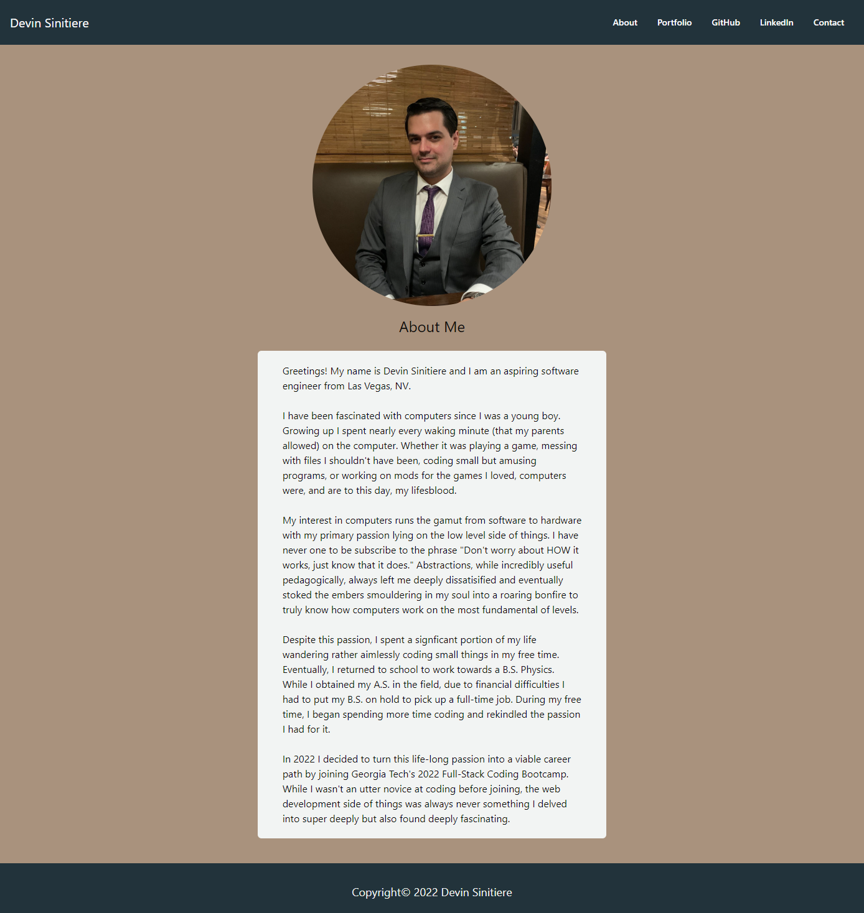

# portfolio_website_new #

## Description ##

This repository contains the source code for my personal website. It is built using ReactJS, NodeJS, Webpack, and TailwindCSS. The primary goal in the development of this website was to explore using React to create a personal portfolio website where I can showcase my work while also improving and reinforcing my knowledge of the React framework. As such, it is more utilitarian in its layout and overall design philosophy. I am planning to design and code a more crafted, personalized, and creative website in the coming months to better test my skills with React and Tailwind while showcasing my strengths through a website I find personally satisfying.

## Live Website ##

https://chromodyne.github.io/portfolio_website_new/

## Screenshot ##

